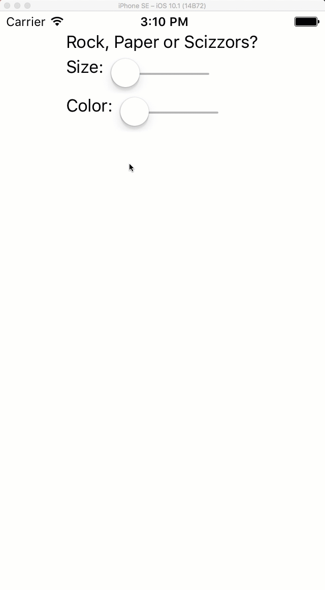

# Font Icons in Xamarin.Forms

Stop the bitmap apocalypse! 

Use custom fonts (such as FontAwesome) to create resizable, recolorable icons throughout your app 🤘

Why do you want to do this:
 - Less image resources == smaller appsize
 - Fonts are rendered vectors!
  - Resize it by changing the font size!
  - Recolour it by changing the font color!
 - No more image density wrangling bs for Android.
  
**Example**

